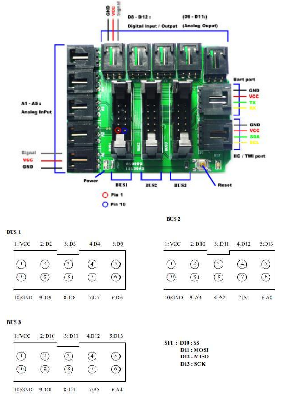

# ArduinoML ANTLR4 implementation

  * Author: [Sebastien Mosser](mailto?mosser@i3s.unice.fr)
  * Version: 1.0

This is a quick and dirty implementation of the ArduinoML kernel, using the Java language.

## Organization

  * The `pom.xml` file models the directory as a Maven project. It triggers the ANTLR4 code generation plugin during 
    the build phase to generate the Java code associated to the grammar. It also make possible to run the compiler
    from the command line
  * The `src/main/antlr4` directory contains the grammar (using java convention to implement packages as directories)
  * The `src/main/java` directory contains the compiler code

## Running the example

We consider here that the current directory is the `antlr` directory. 

  1. Make sure the ArduinoML JVM kernel is installed in your local maven repository
    * `cd ../../kernels/jvm; mvn clean install`
  2. Then, compile the ANTLR code
    * `mvn clean package`
  3. Run the compiler using the `exec` plugin:
    * `mvn exec:java -Dexec.args=src/main/resources/dual_check_alarm.arduinoml`
    
## Code Description

### The G4 Grammar

The grammar `ArduinoML.g4` defines two elements:

  1. _Lexer_ rules that translates a stream of characters into legible tokens;
  2. _Parser_ rules that translates a stream of tokens into abstract syntax tree nodes.

In addition to these elements, we define at the end of the grammar some helper rules that will skip whitespaces or comments and give name such as `LOWERCASE` to regular expressions used elsewhere in the grammar.

### Implementing a Listener
Based on the grammar, ANTLR build an _Abstract Syntax Tree_ (AST) associated to the grammar. We need to translate this AST into the semantic model associated to the ArduinoML case study (basically, Java classes defined in the `kernel` module).
To perform such a classical task, ANTLR provides a listener-based mechanism. Using this mechanism, you delegate the traversal of the AST and simply register methods that react when entering or exiting nodes of the AST. This is the opposite of a classical visitor, where you control the visiting process. One can ask ANTLR to generate a visitor using a special compilation argument, but for the sake of the example we consider here the usage of the listener approach.

### Executing the compilation process
Running the compiler is quite straightforward (`Main.java`).
First, we obtain a `CharStream` from the file to be used as input by the compiler (method `getCharStream`). Then, we run the compiler on this char stream to obtain an instance of `App` (method `buildModel`), the representation defined by the kernel to model an ArduinoML application. Finally, we trigger a visit of this model to generate the code to be executed on the Arduino board.

### Importing in IntelliJ

For the IntelliJ IDE, do not forget to right-click on the `antlr4` directory inside the `target` one (obtained after running the ANTLR tool on the g4 grammar) ans select _"mark directory as generated source root"_. It will allow IntelliJ to deal with the generated source easily.

## Extension of the ArduinoML Compiler
To avoid conflicts with the existing code, we have created a kernel specificaly for the antlr4 complier. To build solutions, you have to use the `kernel-jvm-external` module.

## The PIN Allocation Generator
### Intro
In order to use dynamically the pins of the Arduino board, we need to allocate them at runtime. The `PinAllocator` class is responsible for this task. It is a simple class that maintains a list of available pins and allocates them one by one when requested. It is used by the `ModelBuilder` to allocate pins to the different components of the ArduinoML model.

### Grammar
The grammar as been modified to match with the pinAllocator. The user can now skip the pin allocation and just enter his bricks (sensors / actuators) and the pinAllocator will allocate the pins for him.
We've removed the `pin` keyword from the grammar

### Kernel
We added a new class `PinAllocator` in the kernel module. In order to use it, at the visit beggining of the model, we allocate the pins to the components.

### PIN Allocation
According to this sheme, here is the pin allocation for the different components:

| Type de Broche	 | Numéros des broches                     |
|-----------------|-----------------------------------------|
| Analog IN       | 	A1(15), A2(16), A3(17), A4(18), A5(19) |
| Digital IN/OUT  | 	8 - 12                                 |
| PWM (Analog OUT)	| 9, 10, 11                      |

### Example

`mvn exec:java -Dexec.args=src/main/resources/pin_allocation_too_many_analogOutput.arduinoml`
-> show that the pinAllocator will throw an exception if the user tries to allocate more than 6 analogOutput components

`mvn exec:java -Dexec.args=src/main/resources/pin_allocation_type.arduinoml`
-> show that pinAllocator allocate the pins correctly according to the type of the component and if it's an input or an output

`mvn exec:java -Dexec.args=src/main/resources/pin_allocation_multiActuatorDemo.arduinoml`
->  This scenario shows dynamic allocation for a complex mix of sensors and actuators (two digital and two analog). The transitions between states demonstrate that each component is correctly configured.

`mvn exec:java -Dexec.args=src/main/resources/pin_allocation_allon.arduinoml`
-> This case tests the limits of your extension, requiring dynamic allocation for several digital and analog components.

`mvn exec:java -Dexec.args=src/main/resources/pin_allocation_bad_type.arduinoml`
-> This case should throw an exception due to the bad type of the component "ANALOGIC" instead of "ANALOG"
